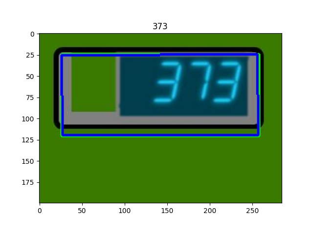

# 7SEG

## META

**TRAIN ONLY** Synthetic dataset of seven-segment indicators. Useful for detecting numbers on devices.

## GENERATE

To generate the dataset, js+html+css is used.
Libraries:

- jquery
- knockout
- sevenSeg (Modified)

The dataset is generated via python + chromenium.

### Pre required

The generation uses the python environment and some auxiliary libraries.

They should be installed according to the following instructions:

```bash
apt install chromium-browser
pip install html2image tqdm numpy opencv-python-headless
```

```bash
python3 generate.py --images_dir 7_seg_dataset
```

## CONVERT TO HUGGINGFACE FORMAT

<https://huggingface.co/datasets/MiXaiLL76/7SEG_OCR>

## READY DATASETS

| Base 1                                   | Base 2                                   | Base 3                                   | Base 4                                   | Base 5                                   |
| ---------------------------------------- | ---------------------------------------- | ---------------------------------------- | ---------------------------------------- | ---------------------------------------- |
|  |  |  |  |  |
