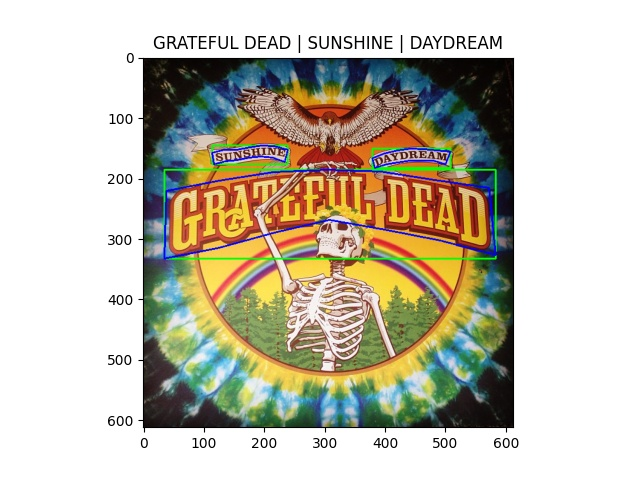
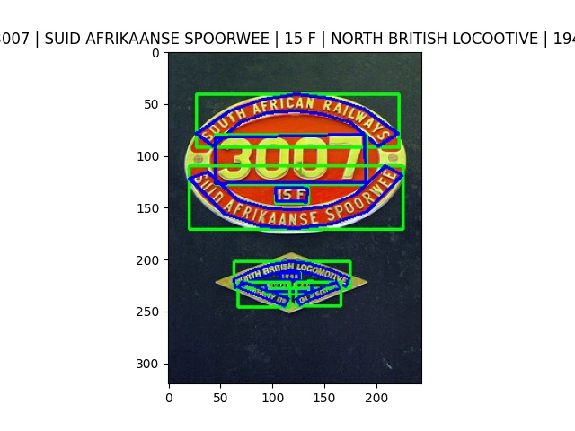

# CTW1500

## META

<https://github.com/open-mmlab/mmocr/blob/main/dataset_zoo/ctw1500/metafile.yml>

```yaml
Name: 'CTW1500'
Paper:
  Title: Curved scene text detection via transverse and longitudinal sequence connection
  URL: https://www.sciencedirect.com/science/article/pii/S0031320319300664
  Venue: PR
  Year: '2019'
  BibTeX: '@article{liu2019curved,
  title={Curved scene text detection via transverse and longitudinal sequence connection},
  author={Liu, Yuliang and Jin, Lianwen and Zhang, Shuaitao and Luo, Canjie and Zhang, Sheng},
  journal={Pattern Recognition},
  volume={90},
  pages={337--345},
  year={2019},
  publisher={Elsevier}
}'
Data:
  Website: https://github.com/Yuliang-Liu/Curve-Text-Detector
  Language:
    - English
  Scene:
    - Scene
  Granularity:
    - Word
    - Line
  Tasks:
    - textrecog
    - textdet
    - textspotting
  License:
    Type: N/A
    Link: N/A
  Format: .xml
```

## DOWNLOAD

<https://gist.github.com/MiXaiLL76/93aba8ba2c1e2296dbe1dd22d962d76e>

```bash

wget -O train_images.zip https://universityofadelaide.box.com/shared/static/py5uwlfyyytbb2pxzq9czvu6fuqbjdh8.zip && unzip -qq train_images.zip
wget -O train_labels.zip https://universityofadelaide.box.com/shared/static/jikuazluzyj4lq6umzei7m2ppmt3afyw.zip && unzip -qq train_labels.zip

wget -O ctw1500_test_images.zip https://universityofadelaide.box.com/shared/static/t4w48ofnqkdw7jyc4t11nsukoeqk9c3d.zip && unzip -qq ctw1500_test_images.zip
wget -O ctw1500_test_labels.zip https://gist.github.com/MiXaiLL76/93aba8ba2c1e2296dbe1dd22d962d76e/raw/2866165cc2c276ffa53849f7026c052c3ed774ed/ctw1500_test_labels.zip && unzip -qq ctw1500_test_labels.zip

```

## CONVERT

```bash
python3 convert_to_general_format.py --labels_dir ctw1500_train_labels --images_dir train_images
python3 convert_to_general_format.py --labels_dir ctw1500_test_labels --images_dir test_images
```

## CONVERT TO HUGGINGFACE FORMAT

<https://huggingface.co/datasets/MiXaiLL76/CTW1500_OCR>

## READY DATASETS

| TRAIN                                            | TEST                                           |
| ------------------------------------------------ | ---------------------------------------------- |
|  |  |
