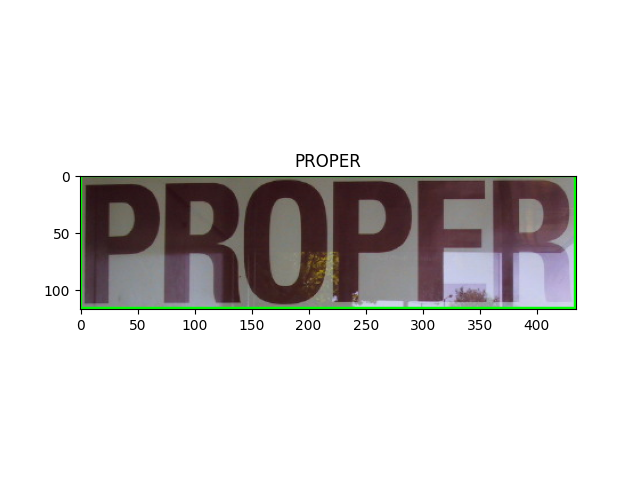
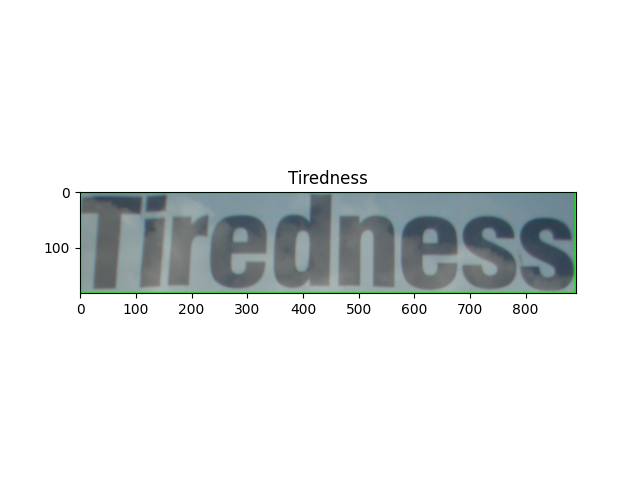

# ICDAR2013

## META

<https://github.com/open-mmlab/mmocr/blob/main/dataset_zoo/icdar2013/metafile.yml>

```yaml
Name: 'Incidental Scene Text IC13'
Paper:
  Title: ICDAR 2013 Robust Reading Competition
  URL: https://www.imlab.jp/publication_data/1352/icdar_competition_report.pdf
  Venue: ICDAR
  Year: '2013'
  BibTeX: '@inproceedings{karatzas2013icdar,
  title={ICDAR 2013 robust reading competition},
  author={Karatzas, Dimosthenis and Shafait, Faisal and Uchida, Seiichi and Iwamura, Masakazu and i Bigorda, Lluis Gomez and Mestre, Sergi Robles and Mas, Joan and Mota, David Fernandez and Almazan, Jon Almazan and De Las Heras, Lluis Pere},
  booktitle={2013 12th international conference on document analysis and recognition},
  pages={1484--1493},
  year={2013},
  organization={IEEE}}'
Data:
  Website: https://rrc.cvc.uab.es/?ch=2
  Language:
    - English
  Scene:
    - Natural Scene
  Granularity:
    - Word
  Tasks:
    - textdet
    - textrecog
    - textspotting
  License:
    Type: N/A
    Link: N/A
  Format: .txt
```

## DOWNLOAD

```bash

wget --no-check-certificate -O ic13_textrecog_train_img_gt.zip https://rrc.cvc.uab.es/downloads/Challenge2_Training_Task3_Images_GT.zip && unzip ic13_textrecog_train_img_gt.zip -d ic13_textrecog_train_img_gt
wget --no-check-certificate -O ic13_train_labels.json https://download.openmmlab.com/mmocr/data/1.x/recog/icdar_2013/train_labels.json

wget --no-check-certificate -O ic13_textrecog_test_img.zip https://rrc.cvc.uab.es/downloads/Challenge2_Test_Task3_Images.zip && unzip ic13_textrecog_test_img.zip -d ic13_textrecog_test_img
wget --no-check-certificate -O textrecog_test.json https://download.openmmlab.com/mmocr/data/1.x/recog/icdar_2013/textrecog_test_1015.json

```

## CONVERT

```bash
python3 convert_to_general_format.py --labels ic13_train_labels.json --images_dir ic13_textrecog_train_img_gt
python3 convert_to_general_format.py --labels textrecog_test.json --images_dir ic13_textrecog_test_img
```

## CONVERT TO HUGGINGFACE FORMAT

<https://huggingface.co/datasets/MiXaiLL76/ICDAR2013_OCR>

## READY DATASETS

| TRAIN                                                     | TEST                                                       |
| --------------------------------------------------------- | ---------------------------------------------------------- |
|  |  |
