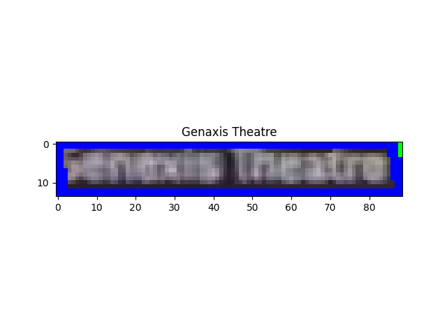
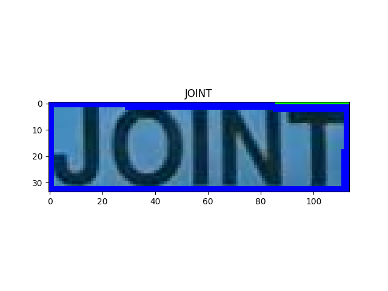

# ICDAR2015

## META
<https://github.com/open-mmlab/mmocr/blob/main/dataset_zoo/icdar2015/metafile.yml>

```yaml
Name: 'Incidental Scene Text IC15'
Paper:
  Title: ICDAR 2015 Competition on Robust Reading
  URL: https://rrc.cvc.uab.es/files/short_rrc_2015.pdf
  Venue: ICDAR
  Year: '2015'
  BibTeX: '@inproceedings{karatzas2015icdar,
  title={ICDAR 2015 competition on robust reading},
  author={Karatzas, Dimosthenis and Gomez-Bigorda, Lluis and Nicolaou, Anguelos and Ghosh, Suman and Bagdanov, Andrew and Iwamura, Masakazu and Matas, Jiri and Neumann, Lukas and Chandrasekhar, Vijay Ramaseshan and Lu, Shijian and others},
  booktitle={2015 13th international conference on document analysis and recognition (ICDAR)},
  pages={1156--1160},
  year={2015},
  organization={IEEE}}'
Data:
  Website: https://rrc.cvc.uab.es/?ch=4
  Language:
    - English
  Scene:
    - Natural Scene
  Granularity:
    - Word
  Tasks:
    - textdet
    - textrecog
    - textspotting
  License:
    Type: CC BY 4.0
    Link: https://creativecommons.org/licenses/by/4.0/
  Format: .txt
```

## DOWNLOAD

```bash

wget --no-check-certificate -O ic15_textrecog_train_img_gt.zip https://rrc.cvc.uab.es/downloads/ch4_training_word_images_gt.zip && unzip ic15_textrecog_train_img_gt.zip -d ic15_textrecog_train_img_gt
wget --no-check-certificate -O ic15_textrecog_test_img.zip https://rrc.cvc.uab.es/downloads/ch4_test_word_images_gt.zip && unzip ic15_textrecog_test_img.zip -d ic15_textrecog_test_img
wget --no-check-certificate -O ic15_textrecog_test_img/gt.txt https://rrc.cvc.uab.es/downloads/Challenge4_Test_Task3_GT.txt

```

## CONVERT 

```bash
python3 convert_to_general_format.py --images_dir ic15_textrecog_train_img_gt
python3 convert_to_general_format.py --images_dir ic15_textrecog_test_img
```

## CONVERT TO HUGGINGFACE FORMAT

<https://huggingface.co/datasets/MiXaiLL76/ICDAR2015_OCR>

## READY DATASETS

| TRAIN                                            | TEST                                           |
| ------------------------------------------------ | ---------------------------------------------- |
|  |  |