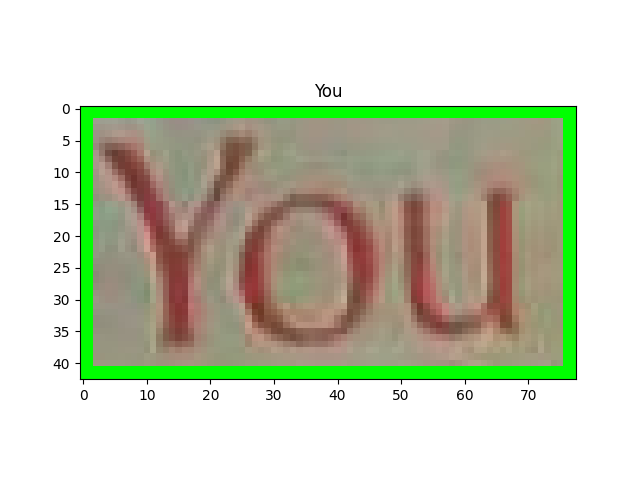
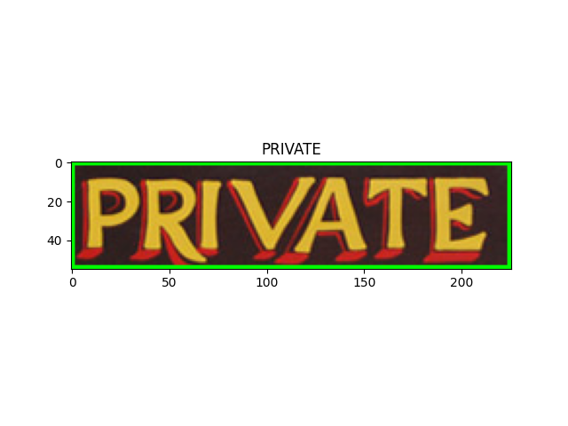

# IIIT5K

## META

<https://github.com/open-mmlab/mmocr/blob/main/dataset_zoo/iiit5k/metafile.yml>

```yaml
Name: 'IIIT5K'
Paper:
  Title: Scene Text Recognition using Higher Order Language Priors
  URL: http://cvit.iiit.ac.in/projects/SceneTextUnderstanding/Home/mishraBMVC12.pdf
  Venue: BMVC
  Year: '2012'
  BibTeX: '@InProceedings{MishraBMVC12,
  author    = "Mishra, A. and Alahari, K. and Jawahar, C.~V.",
  title     = "Scene Text Recognition using Higher Order Language Priors",
  booktitle = "BMVC",
  year      = "2012"}'
Data:
  Website: http://cvit.iiit.ac.in/projects/SceneTextUnderstanding/IIIT5K.html
  Language:
    - English
  Scene:
    - Natural Scene
  Granularity:
    - Word
  Tasks:
    - textrecog
  License:
    Type: N/A
    Link: N/A
  Format: .txt
```

## DOWNLOAD

```bash

wget --no-check-certificate -O IIIT5K.tar.gz http://cvit.iiit.ac.in/projects/SceneTextUnderstanding/IIIT5K-Word_V3.0.tar.gz
wget --no-check-certificate https://download.openmmlab.com/mmocr/data/mixture/IIIT5K/train_label.txt
wget --no-check-certificate https://download.openmmlab.com/mmocr/data/mixture/IIIT5K/test_label.txt

```

## CONVERT

```bash
python3 convert_to_general_format.py --labels train_label.txt --images_dir ./IIIT5K/train
python3 convert_to_general_format.py --labels test_label.txt --images_dir ./IIIT5K/test

```

## CONVERT TO HUGGINGFACE FORMAT

<https://huggingface.co/datasets/MiXaiLL76/IIIT5K_OCR>

## READY DATASETS

| TRAIN                                                  | TEST                                                     |
| ------------------------------------------------------ | -------------------------------------------------------- |
|  |  |
