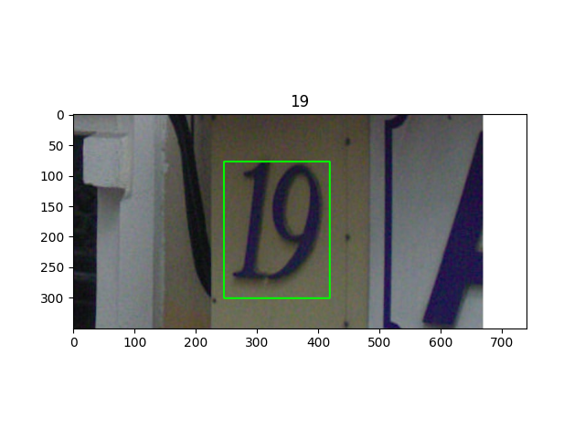
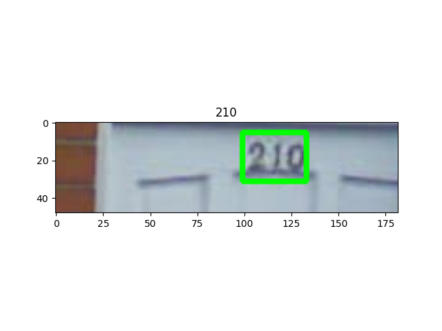

# SVHN

## META
<http://ufldl.stanford.edu/housenumbers/>

```yaml
Name: 'SVHN'
Data:
  Title: The Street View House Numbers (SVHN) Dataset 
  URL: http://ufldl.stanford.edu/housenumbers/
```

## DOWNLOAD

```bash

wget -O train.tar.gz http://ufldl.stanford.edu/housenumbers/train.tar.gz && tar -xvzf train.tar.gz
wget -O test.tar.gz http://ufldl.stanford.edu/housenumbers/test.tar.gz && tar -xvzf test.tar.gz

```

## CONVERT 

```bash
python3 convert_to_general_format.py --images_dir train
python3 convert_to_general_format.py --images_dir test
```

## CONVERT TO HUGGINGFACE FORMAT

<https://huggingface.co/datasets/MiXaiLL76/SVHN_OCR>

## READY DATASETS

| TRAIN                                            | TEST                                           |
| ------------------------------------------------ | ---------------------------------------------- |
|  |  |