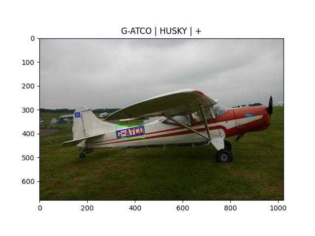
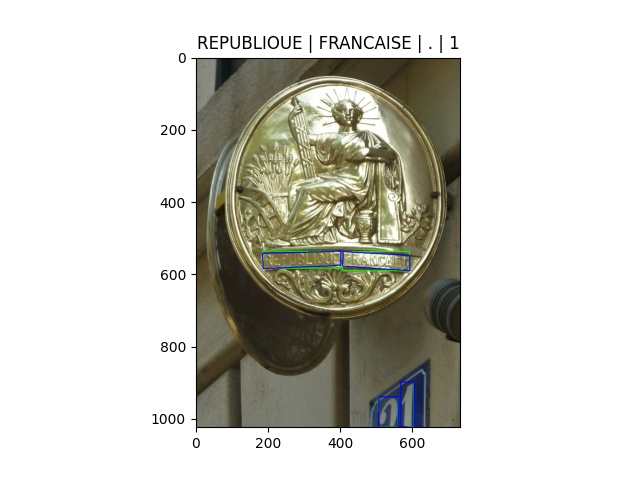

# Text OCR

## META

<https://github.com/open-mmlab/mmocr/blob/main/dataset_zoo/textocr/metafile.yml>

```yaml
Name: 'Text OCR'
Paper:
  Title: 'TextOCR: Towards large-scale end-to-end reasoning for arbitrary-shaped scene text'
  URL: https://openaccess.thecvf.com/content/CVPR2021/papers/Singh_TextOCR_Towards_Large-Scale_End-to-End_Reasoning_for_Arbitrary-Shaped_Scene_Text_CVPR_2021_paper.pdf
  Venue: CVPR
  Year: '2021'
  BibTeX: '@inproceedings{singh2021textocr,
    title={{TextOCR}: Towards large-scale end-to-end reasoning for arbitrary-shaped scene text},
    author={Singh, Amanpreet and Pang, Guan and Toh, Mandy and Huang, Jing and Galuba, Wojciech and Hassner, Tal},
    journal={The Conference on Computer Vision and Pattern Recognition},
    year={2021}}'
Data:
  Website: https://paperswithcode.com/dataset/textocr
  Language:
    - English
  Scene:
    - Natural Scene
  Granularity:
    - Word
  Tasks:
    - textdet
    - textrecog
    - textspotting
  License:
    Type: CC BY 4.0
    Link: https://creativecommons.org/licenses/by/4.0/
  Format: .json
```

## DOWNLOAD

```bash

wget https://dl.fbaipublicfiles.com/textvqa/data/textocr/TextOCR_0.1_train.json # (272MB)
wget https://dl.fbaipublicfiles.com/textvqa/data/textocr/TextOCR_0.1_val.json # (39MB)
wget https://dl.fbaipublicfiles.com/textvqa/images/train_val_images.zip # (6.6GB)
unzip -qq train_val_images.zip
```

## CONVERT

```bash
python3 convert_to_general_format.py --labels TextOCR_0.1_train.json --images_dir train_images
python3 convert_to_general_format.py --labels TextOCR_0.1_val.json --images_dir train_images
```

## CONVERT TO HUGGINGFACE FORMAT

<https://huggingface.co/datasets/MiXaiLL76/TextOCR_OCR>

## READY DATASETS

| TRAIN                                                        | TEST                                                       |
| ------------------------------------------------------------ | ---------------------------------------------------------- |
|  |  |
